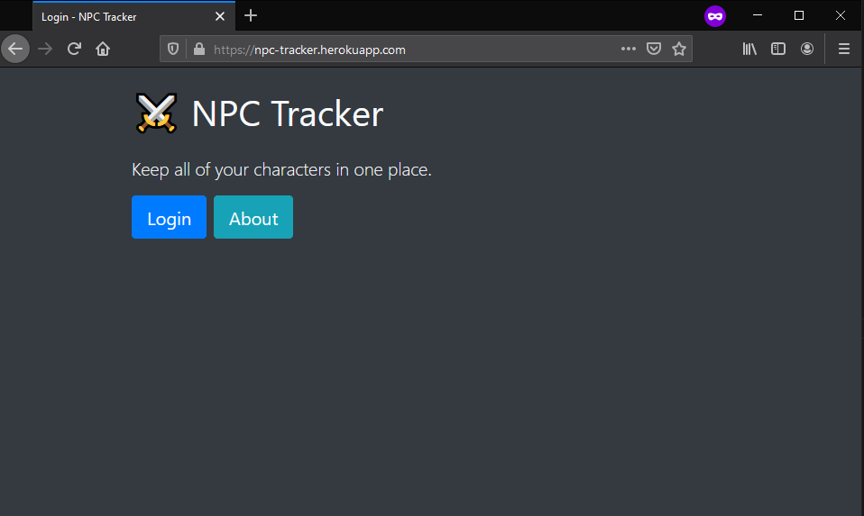

# Character Details Tracker 

### Index
1. [Overview](#overview)
2. [Updates](#updates)
3. [Dependencies](#dependencies)
4. [Setup](#setup)
5. [Usage](#usage)
6. [Error handling](#error-handling)


## Overview

#### Why make this project?
This is my final project for the [Udacity Full Stack Web Developer Nanodegree](https://www.udacity.com/course/full-stack-web-developer-nanodegree--nd004). It is an application that allows people to store details of NPCs (non-player characters) for their table-top role playing games. I put together this project to practice my full stack web development skills and make a tool that I would actually find useful.

#### Who's it for?
The NPC Tracker is for Game and Dungeon Masters, providing a simple tool where they can keep track of all the NPCs in their game.</br>
Within the application, there are two classes: NPCs and Places. NPCs are characters and places are locations where NPCs are based e.g. a specific tavern in a city.


#### How can I access the app?
The NPC Tracker has been deployed to Heroku and is currently working at this link:</br> 
<strong>[https://npc-tracker.herokuapp.com](https://npc-tracker.herokuapp.com/)</strong>

To log in, enter the following credentials:</br>
Email: gm@testing.test</br>
Password: test1!Ta</br>



#### Skills covered
- Relational database architecture
- Modeling data objects with SQLAlchemy
- Internet protocols and communication
- Developing a Flask API
- Authentication and access
- Authentication with Auth0
- Authentication in Flask
- Role-based access control (RBAC)
- Testing Flask applications
- Deploying applications
- Coding in Python 3

## Updates
#### To do
* Assess and improve accessibility of site.
* Redirect to error page when trying to delete a place with linked NPCS.
* Add helper descriptions to the fields on forms.
* Add ability to create a new place when creating an NPC.
* Include view of all NPCs and places that are in a specific location.
* Create a user page, where account data can be downloaded and account deleted.
* Update and improve testing.

#### Done
* **08/03/21**
    * Update functionality to ensure User ID is checked with all data requests.
    * Update NPC forms such that 'Place' only shows places created by the current user.
    * Change link colours to improve contrast against background.
    * Reformat README to include index.

## Dependencies
To access the app locally, you need a database, a virtual environment, dependencies installed, and environment variables set up. You also need an account with Auth0, an authentication service.

1. This app runs on a PostgreSQL database. You can download PostgreSQL at [postgresql.org](https://www.postgresql.org/download/).
2. Then head to [Auth0.com](https://auth0.com/) to create an account.
3. Next, activate a virtual environment:
```
$ cd project_directory_path/
$ pipenv shell
```
4. Install the dependencies for this project using the Pipfile and set up environment variables, adding your Auth0 settings.


## Setup
1. Create a PostgreSQL database locally and add the path to models.py.
2. Start the development server:  
```
$ export FLASK_APP=app.py 
$ export FLASK_ENV=development # enables debug mode  
$ flask run --reload
```

## Usage

### NPC Tracker roles
Users can access the homepage anonymously and, after logging in, a user will have one of two roles. Users can view all places and only NPCs associated with their user ID.

1. <strong>Game Master</strong>: Can complete all CRUD functions for both Npc and Places.
```
Game Master login credentials
Email: gm@testing.test
Password: test1!Ta
```

2. <strong>Viewer</strong>: Can view and create, but cannot edit or delete.
```
Executive producer login credentials
User: viewer@testing.test
Password: test1!Ta
```

### API endpoints
To access the application API, a user needs to be authenticated. Logging in with approved credentials generates a JWT (JSON Web Token) that grants the user access based on their role's permissions.

The NPC Tracker API includes the following endpoints. Below is an overview of their expected behavior.

#### GET /login
- Redirects the user to the Auth0 login page, where the user can log in or sign up
- Roles authorized: all users
- Sample: ```curl http://127.0.0.1:5000/login```

#### GET /callback
- Handles the response from the access token endpoint and stores the user's information in a Flask session
- Roles authorized: game master, viewer
- Sample: ```curl http://127.0.0.1:5000/callback```

#### GET /logout
- Clears the user's session and logs them out
- Roles authorized: all users
- Sample: ```curl http://127.0.0.1:5000/logout```

#### GET /npcs
- Returns a list of all the NPCs in the database
- Roles authorized: game master, viewer
- Sample: ```curl http://127.0.0.1:5000/npcs```

#### GET /places
- Returns a list of all the places in the database
- Roles authorized: game master, viewer
- Sample: ```curl http://127.0.0.1:5000/places```

#### GET /npcs/{npc_id}
- Returns details about each individual NPC listed in the database
- Roles authorized: game master, viewer
- Sample: ```curl http://127.0.0.1:5000/npcs/1```

#### GET /places/{place_id}
- Returns details about each individual place listed in the database
- Roles authorized: game master, viewer
- Sample: ```curl http://127.0.0.1:5000/places/1```

#### GET /npcs/create
- Returns the form to add a new NPC to the database
- Roles authorized: game master
- Sample: ```curl http://127.0.0.1:5000/movies/create```

#### GET /places/create
- Returns the form to add a new place to the database
- Roles authorized: game master
- Sample: ```curl http://127.0.0.1:5000/places/create```

#### POST /npcs/create
- Adds a new NPC to the database
- Roles authorized: game master, viewer

#### POST /places/create
- Adds a new place to the database
- Roles authorized: game master, viewer

#### GET /npcs/{npc_id}/edit
- Returns the form to update a movie project
- Roles authorized: game master
- Sample: ```curl http://127.0.0.1:5000/npcs/1/edit```

#### GET /places/{place_id}/edit
- Returns the form to update a place
- Roles authorized: game master
- Sample: ```curl http://127.0.0.1:5000/npcs/1/edit```

#### POST /npcs/{npc_id}/edit
- Updates an existing NPC with revised details
- Roles authorized: game master

#### POST /places/{place_id}/edit
- Updates an existing place with revised details
- Roles authorized: game master

#### GET /npcs/{npc_id}/delete
- Deletes an NPC from the database
- Roles authorized: game master
- Sample: ```curl http://127.0.0.1:5000/npcs/1/delete```

#### GET /places/{places_id}/delete
- Deletes a place from the database
- Roles authorized: game master
- Sample: ```curl http://127.0.0.1:5000/places/1/delete```


### Error handling
The error codes currently returned are:
- 400: Bad request  
- 401: Unauthorized
- 404: Resource not found
- 405: Method not allowed
- 422: Unprocessable
- 500: Internal server error
- AuthError: Auth0 error status code and description
